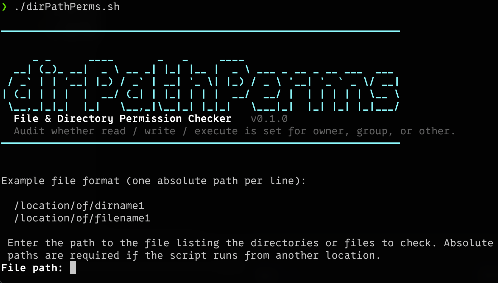

# dirPathPerms

[](https://github.com/iamteedoh/dirPathPerms/actions/workflows/ci.yml)

[](https://github.com/sponsors/iamteedoh)
[](https://patreon.com/iamteedoh)
[](https://buymeacoffee.com/iamteedoh)

# File Permission Checker Script

## Overview

This Bash script checks specific file or directory permissions (Owner, Group, or Other; Read, Write, or Execute) for the paths you give it — either named directly, or listed one per line in an input file. It provides clear, color-coded output indicating whether the specified permission is set for each path.

It greets you with a big title banner and a short description, then runs either
**interactively** — prompting for the input file and the permission to check —
or **non-interactively** via command-line flags, which makes it easy to drop
into scripts and CI. When any required value is omitted and a terminal is
attached, the script prompts for it; when nothing is attached (a pipe or CI
job), it fails fast with a clear message instead of hanging.

<p align="center">
  
</p>

## Use Case

This script is useful for:

* **System Auditing:** Quickly verifying if critical files or directories have the correct permissions set for specific users (owner, group members, others).
* **Configuration Management:** Ensuring that deployed files or directories match the intended permission policies.
* **Troubleshooting:** Diagnosing permission-related issues by checking specific access rights across multiple locations.
* **Security Checks:** Identifying potentially insecure permissions (e.g., world-writable files).

## Features

* **Title banner:** prints a big ASCII title and a one-line description each run.
* **Two run modes:** fully interactive prompts, or non-interactive with flags
  (`--path`/`--file`, `--who`, `--perm`) for scripting and CI.
* **Check a path directly** with `--path` (repeatable) or a bare argument — no
  need to author a list file just to check one directory.
* Checks permissions for files and directories listed in a specified input file.
* **Interactive session:** run it with no arguments and it keeps asking for
  paths until you press `q`, so checking ten paths does not mean launching it
  ten times.
* **Command-line history:** the interactive prompt supports arrow-key recall and
  full line editing, so a typo does not mean retyping the whole path.
* **Results as a table:** one row per path, with headers and alternating row
  shading so adjacent rows stay easy to tell apart.
* Allows checking for Owner (`u`), Group (`g`), or Other (`o`) permissions, or
  **all three at once** with `--all`.
* Allows checking for Read (`r`), Write (`w`), or Execute (`x`) permissions, or
  **all three at once** with `--perm all`. Combine with `--all` for the full
  3×3 matrix of every permission against every class.
* Interactive prompts guide the user to select the input file and the desired
  permission check, and validate every choice.
* Clear, color-coded output:
    * **Green (`YES`)**: The specified permission is set.
    * **Red (`NO`)**: The specified permission is **not** set.
* A **summary line** at the end with granted / denied / skipped counts.
* Displays the full permission string (e.g., `owner rwx | group r-x | other r--`)
  for context in the output.
* **Comment & blank-line support:** lines in the input file that are empty or
  start with `#` are skipped, including indented ones.
* **Forgiving path input:** a leading `~`, a `$VAR`, surrounding quotes,
  backslash-escaped spaces, stray indentation, and Windows (CRLF) line endings
  are all handled, so a path pasted out of Finder or a terminal just works.
  Paths are only ever expanded, never executed.
* Gracefully handles and reports paths listed in the input file that do not exist.
* **Cross-platform:** works with both GNU (`stat -c`) and BSD/macOS (`stat -f`)
  `stat`, so no GNU coreutils install is required on macOS.
* Color is disabled automatically when output is piped or redirected, and can be
  turned off explicitly with `--no-color` (or the `NO_COLOR` environment variable).
* `--help` and `--version` flags.

## Prerequisites

* A Bash-compatible shell (standard on most Linux distributions and macOS).
* Standard Unix/Linux command-line utilities, specifically:
    * `stat` for retrieving file permissions. The script auto-detects GNU
      (`stat -c '%A'`) and BSD/macOS (`stat -f '%Sp'`) variants, so it works on
      Linux and macOS out of the box — no GNU coreutils install required.
    * `read`, `printf`, `tr` (standard shell built-ins / utilities).

## Installation

1.  Save the script content to a file, for example, `dirPathPerms.sh`.
2.  Make the script executable:
    ```bash
    chmod +x dirPathPerms.sh
    ```

## How to Run

You can either name the paths you want to check directly, or put them in an
input file (see [Input File Format](#input-file-format) below) when you have
many to audit at once.

### Interactive

```bash
./dirPathPerms.sh
```

Run with no arguments it becomes a **session**:

* Enter **either** a path to check (`~/Documents`) **or** a file listing paths
  to check (`myPaths.txt`) — see [how the two are told apart](#paths-vs-lists).
* Choose whose permissions to check, and which permission to look for.
* Read the results table, then **enter another path**. The script keeps asking,
  reusing your answers, until you press **`q`**.
* Use the **up and down arrows** to recall anything you have already typed this
  session, and the usual line-editing keys to fix a typo.

### Non-interactive

Supply the values as flags and the script runs without prompting — ideal for
scripts, cron jobs, and CI:

```bash
# Check a single path directly
./dirPathPerms.sh --path ~/Documents --who owner --perm read

# A bare path works the same way
./dirPathPerms.sh -w owner -p r ~/Documents

# Several paths at once
./dirPathPerms.sh -P /etc/passwd -P /var/log --who group --perm write

# The full picture: every permission, for every class
./dirPathPerms.sh --path ~/Documents --all --perm all

# Does the group have write access to every listed path?
./dirPathPerms.sh --file paths.txt --who group --perm write

# Show read access for owner/group/other across all paths, colors off
./dirPathPerms.sh --all --perm read --file paths.txt --no-color

# A list file can also be passed positionally
./dirPathPerms.sh -w owner -p x paths.txt
```

Supplying everything via flags checks once and exits — no session loop — which
is what makes it usable from cron and CI.

<h3 id="paths-vs-lists">Paths vs. lists</h3>

A bare argument might be the path you want to check, or a file listing paths to
check. The script decides by **looking inside it**: a file whose first
meaningful line is a path (starting with `/`, `~`, or `$`) is read as a list;
anything else is checked directly. So `myPaths.txt` is a list, while
`/etc/passwd` is checked as a file — rather than having its contents mistaken
for a list of paths.

Use `--path` or `--file` when you want to say which you meant, instead of
relying on the guess.

If some (but not all) values are provided, the script prompts for the rest when
a terminal is attached, or exits with a helpful error when one is not.

### Command-line options

| Option | Description |
|---|---|
| `-P`, `--path PATH` | Check `PATH` directly. Repeatable. Use instead of `--file` to check one or more paths without writing a list file. |
| `-f`, `--file FILE` | Input file: one absolute path per line. Blank lines and `#` comments are ignored. |
| `-w`, `--who WHO` | Whose permission to check: `owner`\|`group`\|`other` (aliases `u`\|`g`\|`o`). |
| `-p`, `--perm PERM` | Permission to check: `read`\|`write`\|`execute`\|`all` (aliases `r`\|`w`\|`x`\|`a`). `all` checks read, write and execute together. |
| `-a`, `--all` | Check owner, group **and** other at once. |
| `--no-color` | Disable colored output (also honors the `NO_COLOR` env var). |
| `-h`, `--help` | Show help and exit. |
| `-V`, `--version` | Print the version and exit. |

## Input File Format

The input file should be a plain text file where **each line contains exactly one absolute path** to a file or directory.

* **Absolute paths are required** to ensure the script can find the files/directories regardless of where the script itself is executed from.
* **Blank lines and lines starting with `#` are ignored**, so you can annotate and space out the file freely.

### How a path line is read

Paths get written by hand and pasted out of file managers, so each line is
tidied up before it is looked up. In order:

| Written in the file | Checked as |
|---|---|
| `  /var/log  ` | `/var/log` — surrounding whitespace is trimmed |
| `/var/log` + `CRLF` | `/var/log` — a Windows line ending is stripped |
| `"/my file.txt"` or `'/my file.txt'` | `/my file.txt` — one surrounding pair of quotes is removed |
| `/my\ file.txt` | `/my file.txt` — backslash escapes are resolved (this is what dragging a file from Finder into a terminal produces) |
| `~/Documents` | `/Users/you/Documents` — a leading `~` expands to your home directory |
| `~alice/Documents` | `alice`'s home directory |
| `$HOME/Documents`, `${HOME}/Documents` | environment variables are expanded |

Two guarantees worth knowing:

* **Nothing is ever executed.** `$(...)` and backticks are left as literal text,
  so an input file can only ever name files — it is data, never a script.
* **A literal name always wins.** If a file's name genuinely contains a `~`,
  `$`, quote, or backslash, it is still checked exactly as written.

**Example Input File (`myPaths.txt`):**

```text
# system files
/etc/passwd
/home/user/important_script.sh
/var/log/app.log

# your own files — ~ and $VAR work too
~/Documents/notes.txt
$HOME/.ssh/id_ed25519

/tmp
/non/existent/path
/data/shared_folder
```

## Examples

### Scenario

Let's say you want to check if members of the owning **Group** have **Write** access to the files and directories listed in `myPaths.txt` (using the example file content above). Assume the following permissions exist:

* `/etc/passwd ` : `-rw-r--r--` (Owner: rw, Group: r, Other: r)
* `/home/user/important_script.sh` : `-rwxr-x---` (Owner: rwx, Group: rx, Other: ---)
* `/var/log/app.log` : `-rw-rw----` (Owner: rw, Group: rw, Other: ---)
* `/tmp` : `drwxrwxrwt` (Owner: rwx, Group: rwx, Other: rwt - sticky bit)
* `/non/existent/path` : Does not exist
* `/data/shared_folder` : `drwxrwx---` (Owner: rwx, Group: rwx, Other: ---)

### Running the Script (non-interactive)

```bash
./dirPathPerms.sh --file myPaths.txt --who group --perm write
```

### Expected Output

```text
Checking write permission for Group — from myPaths.txt

┌────────────────────────────────┬───────┬────────────────┐
│ Path                           │ Group │ Mode           │
├────────────────────────────────┼───────┼────────────────┤
│ /etc/passwd                    │  NO   │ -rw-r--r--     │
│ /home/user/important_script.sh │  NO   │ -rwxr-x---     │
│ /var/log/app.log               │  YES  │ -rw-rw----     │
│ /tmp                           │  YES  │ drwxrwxrwt     │
│ /non/existent/path             │   —   │ does not exist │
│ /data/shared_folder            │  YES  │ drwxrwx---     │
└────────────────────────────────┴───────┴────────────────┘

Summary: 3 granted, 2 denied, 1 skipped (5 checked).
```

`YES` is green and `NO` is red, and every other row is shaded so neighbouring
rows never blur together. Colors are omitted when output is piped or
`--no-color` is set.

With `--all`, each class gets its own column. With `--perm all`, each class
column becomes an `R  W  X` matrix of check marks:

```text
┌─────────────────────┬─────────────┬─────────────┬─────────────┬────────────┐
│                     │    Owner    │    Group    │    Other    │            │
│ Path                │  R   W   X  │  R   W   X  │  R   W   X  │ Mode       │
├─────────────────────┼─────────────┼─────────────┼─────────────┼────────────┤
│ /etc/passwd         │  ✓   ✓   ·  │  ✓   ·   ·  │  ✓   ·   ·  │ -rw-r--r-- │
│ /var/log            │  ✓   ✓   ✓  │  ✓   ·   ✓  │  ✓   ·   ✓  │ drwxr-xr-x │
└─────────────────────┴─────────────┴─────────────┴─────────────┴────────────┘

Summary: 2 path(s) checked, 0 skipped — 11 of 18 permission checks granted.
```

## Output Explanation

* **`YES`** (green): the requested permission is set for that class on that path.
* **`NO`** (red): it is not set.
* **`✓` / `·`** (with `--perm all`): the permission is, or is not, set.
* **`Mode`**: the actual mode (`-rw-r--r--`), or why there is no result —
  `does not exist` or `mode unreadable` (yellow).
* **`—`**: no result to report for that class, because the mode could not be read.
* **`Summary`**: a tally of granted / denied / skipped. When more than one class
  or permission is shown, it counts individual permission checks instead.

## License

This project is licensed under the [GNU General Public License v3](LICENSE).

## Contributing

Contributions are welcome — see [CONTRIBUTING.md](CONTRIBUTING.md) for local
setup, the validation suite, and the pull request process.

## Security

Please report vulnerabilities privately as described in
[SECURITY.md](SECURITY.md), not through public issues.
